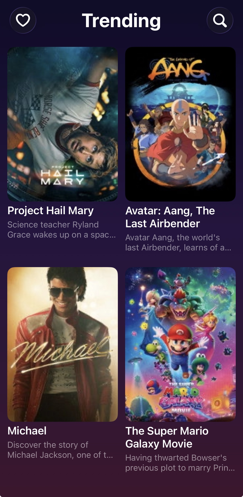
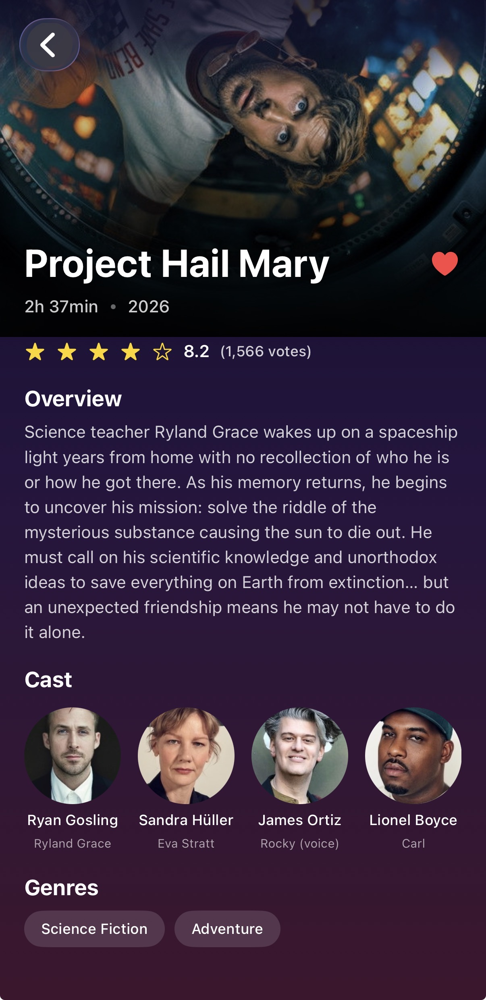
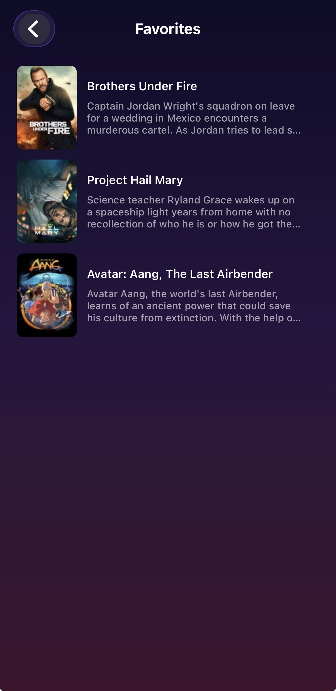
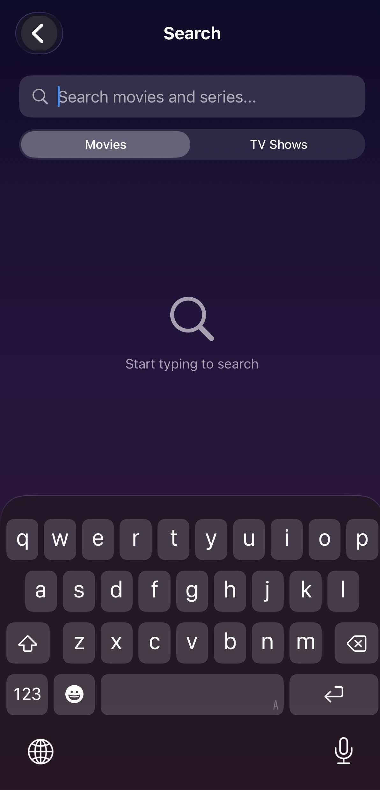
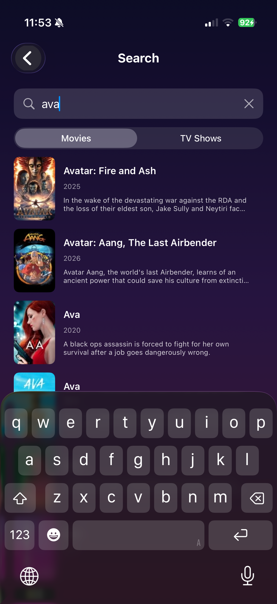
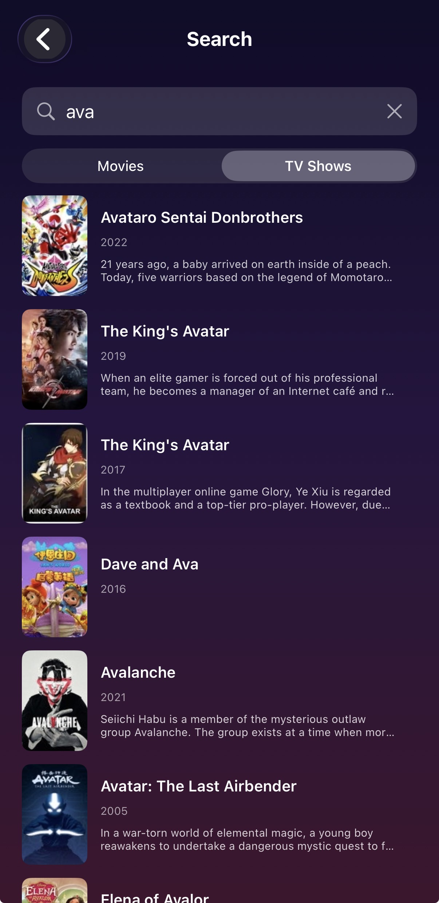
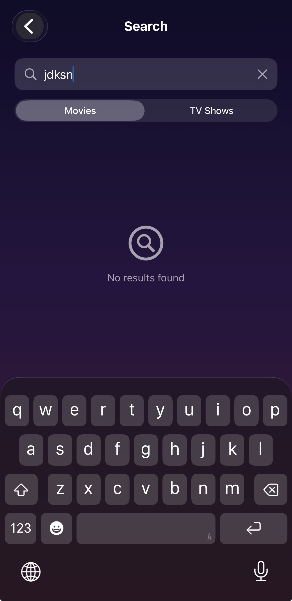
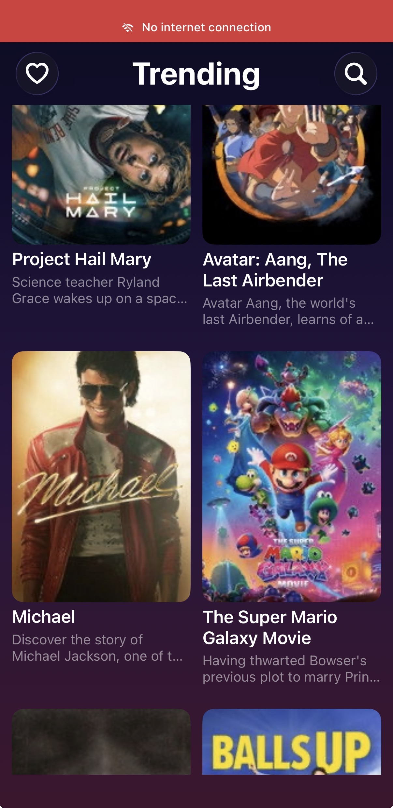

# 🎬 Movies App

A native iOS movie discovery app built with SwiftUI and UIKit, powered by [The Movie Database (TMDB)](https://www.themoviedb.org/) API.

Browse trending movies, search across movies and TV shows, explore detailed information including cast and genres, and save your favorites — all with offline support.

---

## Table of Contents

- [Features](#features)
- [Screenshots](#screenshots)
- [Architecture](#architecture)
- [Project Structure](#project-structure)
- [Tech Stack](#tech-stack)
- [Getting Started](#getting-started)
- [Testing](#testing)
- [Author](#author)

---

## Features

### Core
- **Trending Movies** — Paginated list of trending movies with infinite scroll
- **Movie Details** — Backdrop, overview, cast, genres, rating, and runtime
- **Search** — Debounced search across movies and TV shows with type toggle
- **Custom Navigation** — Router pattern with programmatic navigation

### Bonus
- **Favorites** — Mark movies as favorite, persisted with SwiftData
- **Offline Mode** — Cached trending and detail data available without internet
- **No-Connection Banner** — Global network status indicator
- **Adaptive Layouts** — Responsive design for iPhone, iPad, portrait, and landscape
- **Progressive Image Loading** — Low-res placeholders transition to high-res
- **Image Prefetching** — Content pre-cached concurrently for smooth experience
- **Dev/Prod Environments** — Separate schemes with `.xcconfig` configuration
- **Dark Theme** — Custom design system with gradients and typography

---

## Screenshots

| Trending | Details | Favorites |
|:---:|:---:|:---:|
|  |  |  |

| Search | Search Results | TV Shows |
|:---:|:---:|:---:|
|  |  |  |

| No Search Results | Offline Mode |
|:---:|:---:|
|  |  |

---

## Architecture

The app follows **MVVM + Repository + Clean Architecture** with strict separation of concerns:

```
┌─────────────────────────────────────────┐
│             Views (SwiftUI/UIKit)        │
│        (TrendingView, DetailView...)     │
└────────────────┬────────────────────────┘
                 │ binds to
                 ▼
┌─────────────────────────────────────────┐
│            ViewModels (@Observable)      │
│     (TrendingViewModel, DetailVM...)     │
└────────────────┬────────────────────────┘
                 │ calls
                 ▼
┌─────────────────────────────────────────┐
│         Repositories (Protocols)         │
│   (MovieRepository, OfflineRepository)   │
└────────────────┬────────────────────────┘
                 │ uses
                 ▼
┌─────────────────────────────────────────┐
│       Network Layer + Cache Layer        │
│ (URLSession, Interceptors, OfflineStore,  │
│          SwiftData)                       │
└─────────────────────────────────────────┘
```

### Key Patterns
- **Protocol-Based DI** — All dependencies injected via protocols for testability
- **Router Pattern** — Centralized navigation with `@Observable` + `NavigationPath`
- **Swift Concurrency** — `async/await`, actors, and `@MainActor` isolation
- **Repository Pattern** — Separates data source from business logic

---

## Project Structure

```
MoviesApp/
├── Core/                     # Platform-agnostic, framework-ready code
│   ├── Cache/                # Image prefetching & offline store
│   ├── DI/                   # Dependency injection container
│   ├── Helpers/              # Date formatting, shared utilities
│   ├── Models/               # Codable models (Movie, MovieDetail, etc.)
│   ├── Navigation/           # Router and AppRoute
│   ├── Network/              # Network monitoring
│   ├── Networking/           # URLSession client, interceptors, endpoints
│   ├── Repositories/         # Repository protocol + implementations
│   ├── Storage/              # SwiftData models & managers
│   └── Views/                # Reusable UI components
├── Features/                 # Screens and their ViewModels
│   ├── Trending/             # UIKit collection view + SwiftUI wrapper
│   ├── Detail/
│   ├── Search/
│   └── Favorites/
├── Theme/                    # Design system (colors, typography, spacing)
└── MoviesAppApp.swift        # App entry point
```

---

## Tech Stack

| Layer | Technology |
|---|---|
| UI | SwiftUI (primary), UIKit via `UIViewRepresentable` |
| Language | Swift 5 with `@MainActor` default isolation |
| Concurrency | `async/await`, actors, structured concurrency |
| Networking | URLSession with custom interceptors |
| Persistence | SwiftData (favorites) + file-based JSON cache (offline) |
| Image Loading | [Kingfisher](https://github.com/onevcat/Kingfisher) |
| Linting | SwiftLint |
| Testing | Swift Testing (unit) + XCTest (UI) |
| Environments | Dev / Prod via `.xcconfig` files |

---

## Getting Started

### Prerequisites
- Xcode 26.0+
- Swift 5.0+
- iOS 26.0+ simulator or device
- [TMDB API token](https://www.themoviedb.org/settings/api)

### Installation

1. **Clone the repository:**
```bash
   git clone https://github.com/angelatasik/MoviesApp.git
   cd MoviesApp
```

2. **Open the project:**
```bash
   open MoviesApp.xcodeproj
```

3. **(Optional) Configure signing for real device:**
   
   If you want to run the app on a physical iOS device, create a `Local.xcconfig` 
   file at the project root with your Apple Developer Team ID.
   This file is gitignored. Find your Team ID at 
   [developer.apple.com/account](https://developer.apple.com/account).
   
   For simulator testing, this step is not required — TMDB API credentials 
   are already configured in `Dev.xcconfig` and `Prod.xcconfig`.

4. **Install SwiftLint** (optional but recommended):
```bash
   brew install swiftlint
```

5. **Select a scheme:**
   - `MoviesApp-Dev` — Development configuration
   - `MoviesApp-Prod` — Production configuration

6. **Run:** `⌘R`

---

## Testing

The project achieves **~94% code coverage** on the framework target.

### Test Structure

```
MoviesAppTests/              # Unit tests (Swift Testing framework)
├── SearchViewModelTests     # 20+ tests — debounce, states, errors, pagination
└── NetworkErrorTests        # 11 tests — all error cases covered
```

```
MoviesAppUITests/            # UI tests (XCTest / XCUITest)
├── testOpenMovieDetailFromTrending
├── testSearchForMovie
├── testFavoritesFlow
└── testNoConnectionBannerAppearsWhenOffline
```

### Running Tests

- **All tests:** `⌘U`
- **Unit tests only:** Right-click `MoviesAppTests` in Test Navigator → Run
- **UI tests only:** Right-click `MoviesAppUITests` in Test Navigator → Run


### Testing Highlights
- **Async testing** with `Task.sleep` to verify debounce behavior
- **Protocol-based mocking** via `MockMovieRepository` and `MockImageConfigurationCache`
- **State machine coverage** — initial, loading, success, empty, and error states
- **Edge cases** — whitespace queries, cancellation errors, pagination boundaries
- **UI tests** with accessibility identifiers for stable selectors
- **Offline banner testing** with launch argument `-UITest_ForceOffline`

---

## Author

**Angela Tasikj**  

🌐 [GitHub](https://github.com/angelatasik/MoviesApp)

Built as part of an iOS technical assessment.

---
